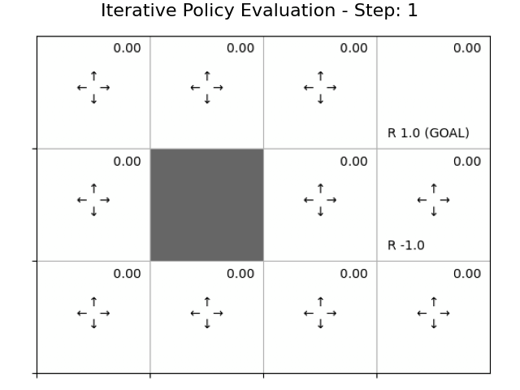
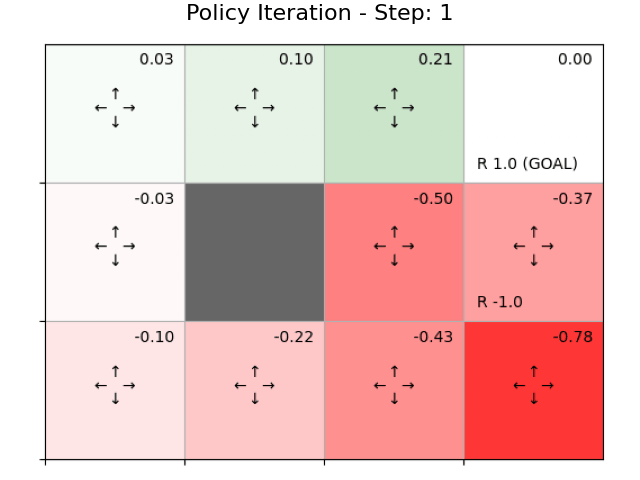
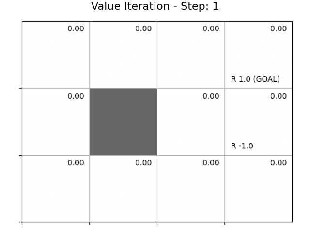

# study_RL

強化学習の勉強

## 動的計画法(DP)

### 反復方策評価(Iterative Policy Evaluation)

方策 $\pi(a|s)$ が与えられたとき，その方策における状態価値関数 $v_\pi(s)$ を計算する方法

$$
V_{k+1}(s) = \sum_{a, s'} \pi(a|s) p(s'|s, a) \{ r(s, a, s') + \gamma V_k(s') \}
$$

> ベルマン方程式を更新式として用いている

状態遷移が決定論的だとすると，

$$
\begin{aligned}
s' &= f(s, a) \text{   として,}\\
V_{k+1}(s) &= \sum_{a} p(s'|s, a) \{ r(s, a, s') + \gamma V_k(s') \}
\end{aligned}
$$

十分に繰り返せば，真の状態価値関数 $v_*(s)$ に収束する

$$
v_*(s) = \lim_{k \to \infty} V_k(s)
$$

> 即時報酬 $r(s, a, s')$ が徐々に全体に広がっていくイメージ？

### 方策反復法(Policy Iteration)

決定論的方策 $\mu(s)$ について，以下を繰り返し

1. 現在の方策 $\mu(s)$ のもと，反復方策評価（収束するまで）

$$
\begin{aligned}
V_{k+1}(s) &= \sum_{a, s'} p(s'|s, a) \{ r(s, a, s') + \gamma V_k(s') \} \\
v_{\mu}(s) &= \lim_{k \to \infty} V_k(s)
\end{aligned}
$$

2. 方策更新(greedy化)

$$
\mu'(s) = \arg\max_{a} \sum_{s'} p(s'|s, a) \{ r(s, a, s') + \gamma v_{\mu}(s') \}
$$

収束して得られる方策 $\mu^*(s)$ が最適方策

### 価値反復法(Value Iteration)

反復方策法をベースとして，方策評価を1回しか行わないことにすると更新式を一つにまとめられる．

$$
\begin{aligned}
V_{k+1}(s) &= \max_a \sum_{s'} p(s'|s, a)\{ r(s, a, s') + \gamma V_k(s') \} \\
V_\ast(s) &= \lim_{k \to \infty} V_k(s) \\
\mu_{\ast}(s) &= \arg\max_a \sum_{s'} p(s'|s, a)\{ r(s, a, s') + \gamma V_{*}(s') \}
\end{aligned}
$$

> ベルマン最適方程式を更新式として用いている

