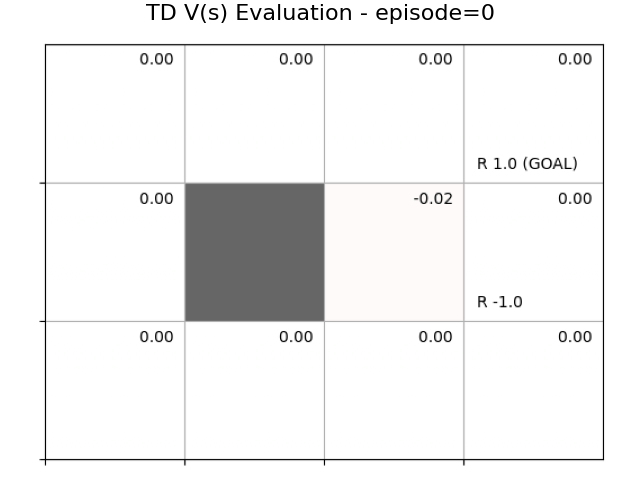

# study_RL

強化学習の勉強

## 動的計画法(Dynamic Programming)

### 反復方策評価(Iterative Policy Evaluation)

方策 $\pi(a|s)$ が与えられたとき，その方策における状態価値関数 $v_\pi(s)$ を計算する方法

```math
V_{k+1}(s) = \sum_{a, s'} \pi(a|s) p(s'|s, a) \{ r(s, a, s') + \gamma V_k(s') \}
```

> ベルマン方程式を更新式として用いている

尚，状態遷移が決定論的だとすると，

```math
\begin{aligned}
s' &= f(s, a) \text{   として,}\\
V_{k+1}(s) &= \sum_{a} \pi(a|s) \{ r(s, a, s') + \gamma V_k(s') \}
\end{aligned}
```

十分に繰り返せば，真の状態価値関数 $v_\pi(s)$ に収束する

```math
v_\pi(s) = \lim_{k \to \infty} V_k(s)
```


> 即時報酬 $r(s, a, s')$ が徐々に全体に広がっていくイメージ？

### 方策反復法(Policy Iteration)

決定論的方策 $\mu(s)$ について，以下を繰り返し

1. 現在の決定論的方策 $\mu(s)$ のもと，反復方策評価（収束するまで）

```math
\begin{aligned}
a &= \mu(s) \text{ として，}\\
V_{k+1}(s) &= \sum_{s'} p(s'|s,a)\{ r(s, a, s') + \gamma V_k(s') \} \\
v_{\mu}(s) &= \lim_{k \to \infty} V_k(s)
\end{aligned}
```

2. 方策更新(greedy化)

```math
\mu(s) \leftarrow \arg\max_{a} \sum_{s'} p(s'|s, a) \{ r(s, a, s') + \gamma v_{\mu}(s') \}
```

収束して得られる方策 $\mu^*(s)$ が最適方策


### 価値反復法(Value Iteration)

反復方策法をベースとして，方策評価を1回しか行わないことにすると更新式を一つにまとめられる．

```math
\begin{aligned}
V_{k+1}(s) &= \max_a \sum_{s'} p(s'|s, a)\{ r(s, a, s') + \gamma V_k(s') \} \\
V_\ast(s) &= \lim_{k \to \infty} V_k(s) \\
\mu_{\ast}(s) &= \arg\max_a \sum_{s'} p(s'|s, a)\{ r(s, a, s') + \gamma V_{*}(s') \}
\end{aligned}
```

> ベルマン最適方程式を更新式として用いている


## モンテカルロ法(Monte Carlo Method)

エピソードごとに得られる報酬 $G^{(i)}$ は，

```math
G^{(i)} = R_0 + \gamma R_1 + \gamma^2 R_2 + \cdots
```

### モンテカルロ法による方策評価

状態価値関数の推定値 $V_\pi(s)$ をモンテカルロ法で計算する．  
各状態 $s$ で $N_s$ 個の報酬サンプル値 $G^{(i)}$ が得られたとして，

```math
V_\pi(s) = \frac{
\begin{array}{c}
G^{(1)} + G^{(2)} + \cdots + G^{(N_s)}
\end{array}
}{N_s}
```


### モンテカルロ法による方策制御

方策の改善に必要な，行動価値関数 $Q_\pi(s, a)$ をモンテカルロ法で計算する.  
方策制御では方策 $\pi(s|a)$ が変動するため，単純な算術平均ではなく指数移動平均を用いる．

```math
Q_n(s, a) = Q_{n-1}(s, a) + \alpha (G^{(n)} - Q_{n-1}(s, a))
```


## TD法(Temporal Difference Method)

エピソード終了時の収益 $G$ を待たずに，即時報酬 $R_t$ を得る度に更新可能.

### TD法による方策評価

収益の再帰構造 $G_t = R_t + \gamma G_{t+1}$ を活用して，

```math
V_{\pi}'(S_t) = V_{\pi}(S_t) + \alpha (R_t + \gamma V_{\pi}(S_{t+1}) - V_{\pi}(S_t))
```

上式内の $R_t + \gamma V_{\pi}(S_{t+1})$ はTDターゲットと呼ばれる．



### SARSA

サンプル値 $(S_t, A_t, R_t, S_{t+1}, A_{t+1})$ を用いて，行動価値関数 $Q_\pi(s, a)$ をTD法で更新する．

```math
Q_{\pi}'(S_t, A_t) = Q_{\pi}(S_t, A_t) + \alpha (R_t + \gamma Q_{\pi}(S_{t+1}, A_{t+1}) - Q_{\pi}(S_t, A_t))
```

行動 $A_t$ はターゲット方策によるものであるため，SARSAは方策オン型(on-policy)に分類される．

.gif)

### Q学習(Q-Learning)

ベルマン**最適**方程式の考え方を用いて，次回の行動 $A_{t+1}$ が行動価値関数 $Q_\pi(s, a)$ を最大化すると仮定する.

```math
Q_{\pi}'(S_t, A_t) = Q_{\pi}(S_t, A_t) + \alpha (R_t + \gamma \max_a Q_{\pi}(S_{t+1}, a) - Q_{\pi}(S_t, A_t))
```

必要なサンプル値は $(S_t, A_t, R_t, S_{t+1})$ のみとなり，greedyな方策 $\pi$ をターゲット方策としつつ，ε-greedy等の別の挙動方策 $b$ を用いてサンプル値を収集できる．  
よって，Q学習は方策オフ型(off-policy)に分類される．


